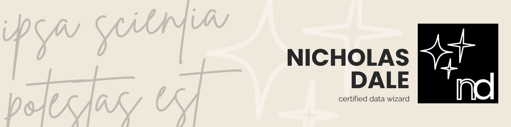
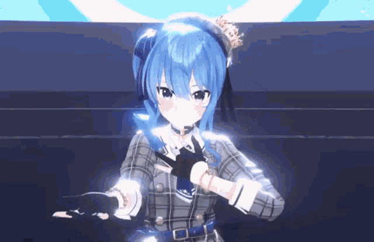

<p align="center">
  
</p>

# hi, i'm nicholas. 👋 
### data scientist × healthcare analyst
nursing student turned data scientist, now back in healthcare where i started. i specialise in clinical and operational BI, ML pipelines, and eliminating manual processes at scale.

---

### stack

```yaml
languages:   ["Python", "SQL (PostgreSQL · BigQuery · SQL Server)", "DAX", "M"]
bi_and_viz:  ["Power BI", "Tableau"]
ml_and_nlp:  ["LSTM RNN", "CNN", "LoRA fine-tuning", "scikit-learn"]
infra:       ["Azure Databricks", "GCP", "Docker", "Fly.io", "HF Spaces ZeroGPU"]
automation:  ["Power Query", "VBA"]
```

---

### selected work

**[nikko-companion](https://github.com/equinox013/nikko-companion)** — safety-aligned mental health assistant  
Multi-agent LLM pipeline (Phi-3.5-mini + Gemma-2) with deterministic crisis routing, PubMed evidence retrieval, and three LoRA fine-tuned adapters. Full-stack — React frontend, FastAPI backend, ZeroGPU inference. Near-MVP.

**[hikari · himari · machi](https://github.com/equinox013/hikari)** — complaint driver classification pipeline  
CRF-based PII scrubbing → channel-aware preprocessing → BiLSTM multi-label classifier. Built and deployed in production at South East Water. Replaced manual triage at scale.

---

### by the numbers

<picture>
  <source media="(prefers-color-scheme: dark)"
    srcset="https://github-readme-stats.vercel.app/api?username=equinox013&show_icons=true&hide_border=true&count_private=true&theme=dark&hide=prs&bg_color=0d1117" />
  <source media="(prefers-color-scheme: light)"
    srcset="https://github-readme-stats.vercel.app/api?username=equinox013&show_icons=true&hide_border=true&count_private=true&theme=default&hide=prs" />
  
</picture>
<picture>
  <source media="(prefers-color-scheme: dark)"
    srcset="https://github-readme-stats.vercel.app/api/top-langs/?username=equinox013&layout=compact&hide_border=true&theme=dark&langs_count=6&bg_color=0d1117" />
  <source media="(prefers-color-scheme: light)"
    srcset="https://github-readme-stats.vercel.app/api/top-langs/?username=equinox013&layout=compact&hide_border=true&theme=default&langs_count=6" />
  
</picture>

---

### off the clock

<p align="center">
  <br/><br/>
  anime · Love Live aficionado · gaming · photography (real life and Forza) · self-help reading<br/><br/>
  <em>「だって僕は星だから」— 星街すいせい, Stellar Stellar</em>
</p>
